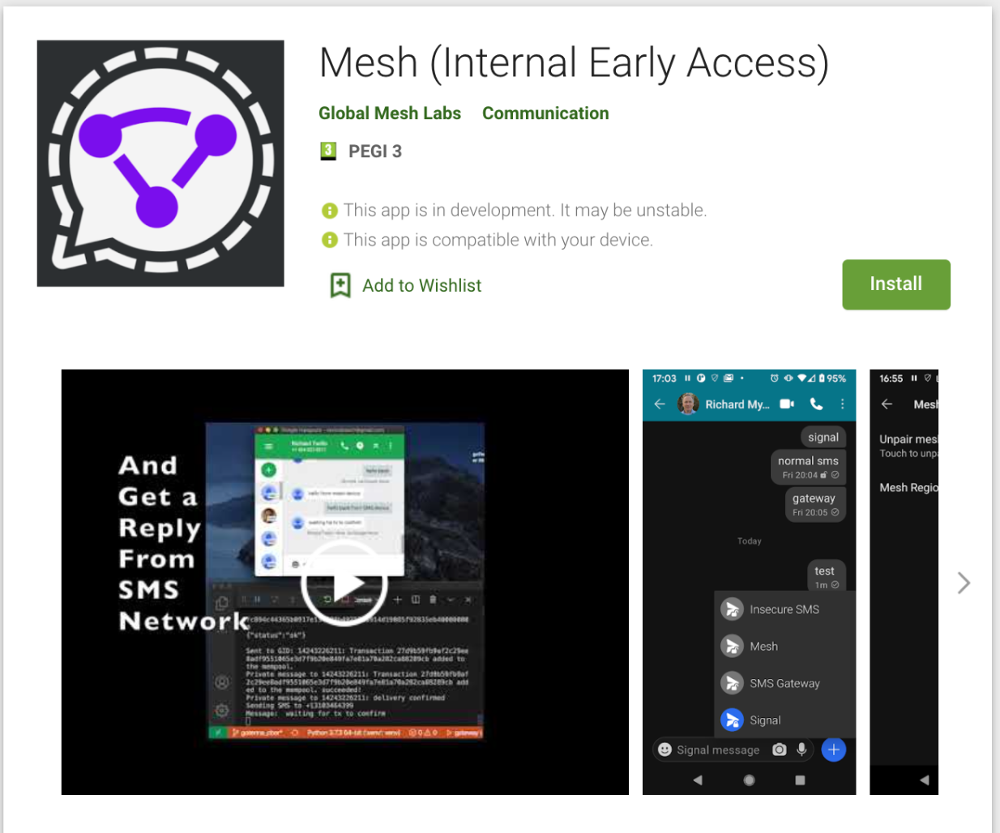

## How to install the GML Mesh App:

1. Email your name and the gmail account associated with your Android phone or tablet to [info@globalmeshlabs.org](mailto:info@globalmeshlabs.org) to be put on the Google Internal Testing list. 
2. Install the [Mesh App](https://play.google.com/store/apps/details?id=org.globalmeshlabs.securesms) from the Google Play Store using the link: [https://play.google.com/apps/internaltest/4699601491912889909](https://play.google.com/apps/internaltest/4699601491912889909)

3. Install the Mesh App from the Google Play store [link](https://play.google.com/store/apps/details?id=org.globalmeshlabs.securesms&ah=2R5i8WWShy43on1mwjZA5-tqoC0).

## How to create the DIY SMS Gateway

  
Follow the steps described in the [DIY Gateway Instructions](https://github.com/global-mesh-labs/Mesh_Gateway/blob/main/DIY-Instructions.md)

## How to use the GML Mesh App:

1. Launch the app from your phone or tablet.
2. From the Settings menu, select Mesh.

5. Turn on your goTenna Mesh, press the ‘Pair Mesh Device’ button and wait for it to change to ‘Unpair Mesh Device’. The lights on the goTenna Mesh will blink twice rapidly and then go dark.
6. From the main screen, press the Pencil icon and select a contact.
7. Press and hold the ‘Plus’ button and select ‘SMS Gateway’; afterwards the text entry will box show ‘SMS Gateway’.

8. Type a message and press the grey ‘Send Arrow’ button.

9. Responses from SMS contacts forwarded from the Mesh Gateway will appear in this window.
